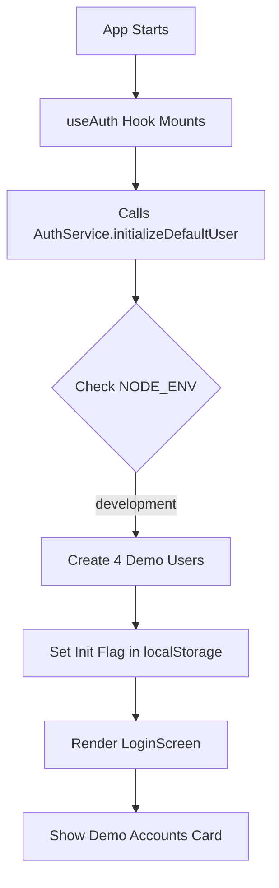
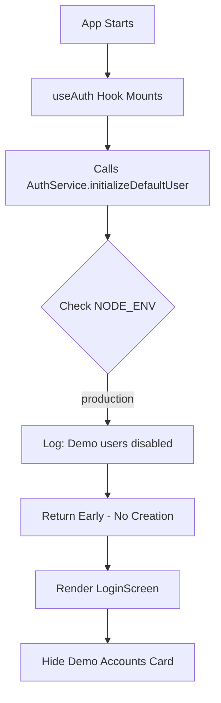

# Demo/Sample Data Initialization - File Reference

## Files Controlling Demo Behavior

This document lists all files that control when demo users and sample data are created.

---

## 1. Demo User Creation

### File: `src/domain/services/AuthService.ts`

**Function**: `initializeDefaultUser()` (Lines 526-623)

**Environment Check** (Line 532):
```typescript
if (process.env.NODE_ENV === 'production') {
  console.log('Production mode: Demo users disabled. Create users via Settings > Users.');
  return;
}
```

**What it creates in DEV mode**:
- `user-admin` → admin@eagleboats.nl / admin123
- `user-office` → office@eagleboats.nl / office123
- `user-sales` → sales@eagleboats.nl / sales123
- `user-production` → production@eagleboats.nl / production123

**Called from**: `src/v4/state/useAuth.tsx` (Line 68)

**Behavior**:
- ✅ DEV mode (`bun run dev`): Creates 4 demo users automatically
- ❌ PROD mode (`bun run start`): Skips creation, logs message

---

## 2. Demo Login Card (UI)

### File: `src/v4/screens/LoginScreen.tsx`

**Section**: Demo Accounts Card (Lines 128-191)

**Environment Check** (Line 129):
```typescript
{process.env.NODE_ENV !== 'production' && (
  <Card className="mt-4 border-dashed">
    {/* Demo account quick-fill buttons */}
  </Card>
)}
```

**What it shows in DEV mode**:
- Admin account quick-fill button
- Sales account quick-fill button
- Production account quick-fill button

**Behavior**:
- ✅ DEV mode (`bun run dev`): Shows demo accounts card
- ❌ PROD mode (`bun run start`): Hides card completely

---

## 3. Sample Library Data

### Status: REMOVED

Sample articles, demo boats, and demo equipment initialization has been removed from the codebase.

**Previously existed in**:
- LibrarySeedService.seedSampleArticles() - **REMOVED**
- BoatModelService.initializeDefaults() - **REMOVED**
- EquipmentCatalogService.initializeDefaults() - **REMOVED**
- WorkInstructionService.initializeSamples() - **REMOVED**

**Database cleanup** handles removing any existing sample data:
- `supabase/migrations/003_safe_production_cleanup.sql`

---

## 4. Library Structure (PRESERVED)

These are NOT demo data - they are generic library structures that remain in both dev and production:

### File: `src/domain/services/LibraryCategoryService.ts`

**Creates**:
- Library categories (Propulsion, Electrical, Navigation, etc.)
- Library subcategories (generic taxonomy)

**Behavior**: Creates in BOTH dev and production (generic structure, not demo data)

---

## Summary Table

| Component | File | Line(s) | Env Check | Dev Behavior | Prod Behavior |
|-----------|------|---------|-----------|--------------|---------------|
| Demo Users | `AuthService.ts` | 526-623 | Line 532 | ✅ Creates 4 users | ❌ Skips creation |
| Login Card | `LoginScreen.tsx` | 128-191 | Line 129 | ✅ Shows card | ❌ Hides card |
| Sample Articles | - | - | - | ❌ Removed | ❌ Removed |
| Demo Boats | - | - | - | ❌ Removed | ❌ Removed |
| Demo Equipment | - | - | - | ❌ Removed | ❌ Removed |
| Library Categories | `LibraryCategoryService.ts` | - | None | ✅ Creates | ✅ Creates |

---

## Environment Check Pattern

All environment checks use this pattern:

```typescript
// Skip in production
if (process.env.NODE_ENV === 'production') {
  return;
}

// OR

// Show in development only
{process.env.NODE_ENV !== 'production' && (
  <DemoContent />
)}
```

**Key Point**: `process.env.NODE_ENV` is set by Next.js based on the command:
- `bun run dev` → `NODE_ENV=development`
- `bun run start` → `NODE_ENV=production`

---

## Initialization Flow

### Development Mode (`bun run dev`)



### Production Mode (`bun run start`)



---

## Testing Environment Checks

### Verify DEV mode works:

```bash
bun run dev
```

**Expected**:
- Console: "Development mode: Creating demo users..."
- Login screen shows demo accounts card
- Can login as admin@eagleboats.nl

### Verify PROD mode works:

```bash
bun run build
bun run start
```

**Expected**:
- Console: "Production mode: Demo users disabled..."
- Login screen does NOT show demo accounts card
- Cannot login as demo accounts (they don't exist)

---

*Reference Document - Demo/Sample Data Initialization*
*Last Updated: March 10, 2026*
