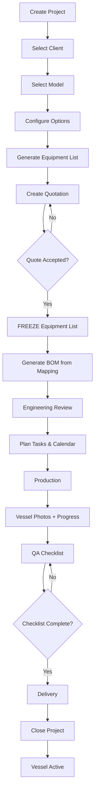
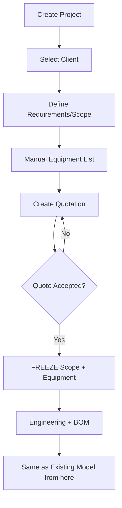
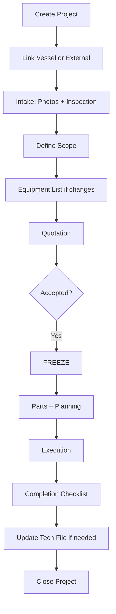
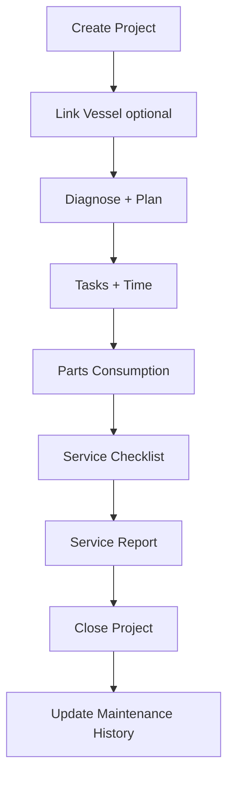

# NAVISOL - Big Bang Migration Plan

## New Navigation Structure

```
📊 Dashboard
   └── Dashboard (overview of all projects, alerts, KPIs)

👥 CRM
   ├── Clients (companies & individuals)
   └── Contacts (people at clients)

📦 Catalog
   ├── Boat Models (model definitions with specs & pricing)
   ├── Parts Database (internal parts with stock)
   ├── Equipment Templates (customer-facing items per model)
   └── Operating Procedures (SOPs)

📋 Projects
   ├── All Projects (unified view)
   ├── New Builds (configure-to-order / custom)
   ├── Refits (external or internal vessels)
   └── Maintenance (service projects)

📅 Planning
   ├── Production Calendar (Gantt view)
   ├── Tasks (task management)
   └── Time Tracking (timer + entries)

💰 Commercial
   ├── Quotations (linked to equipment lists)
   └── Cost Analysis (margins, snapshots)

📄 Documentation
   ├── Documents Library (central repository)
   ├── CE & Technical (technical files, DoC, etc.)
   ├── Vessel Photos (build photos, serials)
   └── Checklist Templates (reusable checklists)

⚙️ Admin
   ├── Users & Roles
   └── Settings
```

---

## Feature Mapping: Current → New

| Current Feature | New Location | Status |
|-----------------|--------------|--------|
| Dashboard | Dashboard | ✅ Keep |
| Client Management | CRM → Clients | ✅ Keep + add Contacts |
| Parts Database | Catalog → Parts Database | ✅ Keep + add hierarchical categories |
| Boat Models | Catalog → Boat Models | ✅ Keep |
| Boat Configurator | Projects → New Build (step 2) | ♻️ Refactor into project flow |
| Saved Configurations | Projects → (per project) | ♻️ Move to project context |
| Production Orders | Projects → All Projects | ♻️ Merge into Projects |
| Production Calendar | Planning → Calendar | ✅ Keep |
| Tasks & Time | Planning → Tasks + Time Tracking | ✅ Split into 2 views |
| Maintenance | Projects → Maintenance | ♻️ Refactor to project type |
| CE Documents | Documentation → CE & Technical | ✅ Keep |
| Technical File | Documentation → CE & Technical | ✅ Merge |
| Vessel Photos | Documentation → Vessel Photos | ✅ Keep |
| Operating Procedures | Catalog → Operating Procedures | ♻️ Move |
| Checklist Templates | Documentation → Checklist Templates | ✅ Keep |
| Parts List Generator | Projects → (per project, BOM) | ♻️ Move to project |
| Equipment List Generator | Projects → (per project) | ♻️ Move to project |
| Quotation Generator | Commercial → Quotations | ♻️ Refactor |
| Cost Comparison | Commercial → Cost Analysis | ✅ Keep |
| User Management | Admin → Users & Roles | ✅ Keep |
| Settings | Admin → Settings | ✅ Keep |

---

## New Flows

### New Build Flow (Existing Model)



### New Build Flow (Custom Boat)



### Refit Flow



### Maintenance Flow



---

## Data Migration

### Phase 1: New Types & Stores
- [ ] Create new TypeScript types (DONE - see new-structure-types.ts)
- [ ] Create new React context stores:
  - [ ] `ProjectStore` (replaces parts of store.ts)
  - [ ] `CatalogStore` (models, parts, equipment templates)
  - [ ] `CommercialStore` (quotations, cost analysis)
  - [ ] `DocumentStore` (documents, photos, checklists)
  - [ ] `PlanningStore` (calendar, tasks, time)
  - [ ] `UserStore` (auth, roles, permissions)

### Phase 2: New UI Components
- [ ] Sidebar with new navigation
- [ ] Project-centric views:
  - [ ] ProjectList (all projects, filterable)
  - [ ] ProjectDetail (tabs: Overview, Config, Equipment, BOM, Tasks, Docs)
  - [ ] NewBuildWizard (steps 1-8)
  - [ ] RefitFlow (intake → completion)
  - [ ] MaintenanceFlow (open → close)

### Phase 3: Migrate Components
- [ ] Dashboard → adapt to new data structure
- [ ] Clients → add Contacts
- [ ] Parts → add hierarchical categories
- [ ] Configurator → embed in NewBuildWizard
- [ ] Calendar → adapt to new event structure
- [ ] Tasks → adapt to new task structure
- [ ] Time Tracking → same, but linked to projects
- [ ] Checklists → adapt to new structure
- [ ] Photos → same, but linked to projects
- [ ] CE Docs → merge into Technical Files view

### Phase 4: Business Logic
- [ ] Quote Acceptance Freeze (Gate A)
- [ ] Delivery Checklist Gate (Gate B)
- [ ] Change Order workflow (Gate C)
- [ ] Equipment → Parts mapping engine
- [ ] Auto-expand checklists from equipment

---

## Key Differences

### Before (Current)
```
Client → ClientBoat (vessel + production mixed)
                  ↓
        Production Orders (separate)
                  ↓
        Articles Database (flat)
                  ↓
        Configurator (standalone wizard)
                  ↓
        Quotation Generator (separate)
```

### After (New)
```
Client + Contacts
        ↓
     Project (NEW_BUILD / REFIT / MAINTENANCE)
        ↓
  ┌─────┴─────┐
Vessel    Configuration
  │           ↓
  │    Equipment List (customer-facing)
  │           ↓
  │    Quotation (references equipment list)
  │           ↓
  │    ══ FREEZE ══ (on acceptance)
  │           ↓
  │       BOM (internal parts list)
  │           ↓
  │    Tasks + Calendar
  │           ↓
  │    Checklist (expanded from equipment)
  │           ↓
  └──→ Vessel ACTIVE (ready for future projects)
```

---

## Estimated Effort

| Phase | Description | Effort |
|-------|-------------|--------|
| 1 | Types & Stores | 2-3 days |
| 2 | New UI Components | 5-7 days |
| 3 | Migrate Components | 3-4 days |
| 4 | Business Logic | 2-3 days |
| 5 | Testing & Polish | 2-3 days |
| **Total** | | **14-20 days** |

---

## Decision Points Before Starting

1. **Confirm Refit statuses**:
   `INTAKE → SCOPED → QUOTED → ACCEPTED → IN_PROGRESS → COMPLETE → CLOSED` ✓?

2. **Vessels table**: Should we track vessels separately from projects?
   (I recommend yes - a vessel can have many projects over its lifetime)

3. **External vessels**: For refits on boats we didn't build - minimal info required?
   (I recommend: just name, client, year, and optional specs)

4. **Equipment template granularity**:
   - One default template per model?
   - Multiple templates per model (e.g., "Sport", "Comfort", "Professional")?

5. **Start fresh or migrate existing data?**
   - Fresh start: simpler, cleaner
   - Migrate: preserve existing clients, parts, etc.

---

## Ready to Start?

Once you confirm the decision points above, I'll begin with:

1. **Phase 1**: Create all new stores with TypeScript types
2. **Phase 2**: Build new Sidebar and navigation structure
3. **Phase 3**: Create Project-centric views

Let me know when you're ready to proceed!
